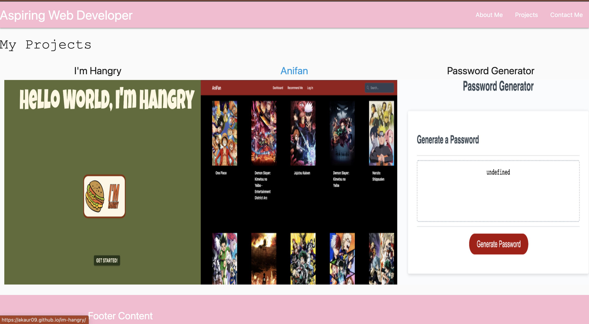

# Professional-Portfolio-3

## Description:
This web application is my updated portfolio made after completing project 2.

Deployed link: https://akaur09.github.io/Professional-Portfolio-3/

## Usage:
- Web application created to display prjoects done in class for potential employers to view
## Features:

## Creditors:
Amnider Kaur https://github.com/akaur09 
